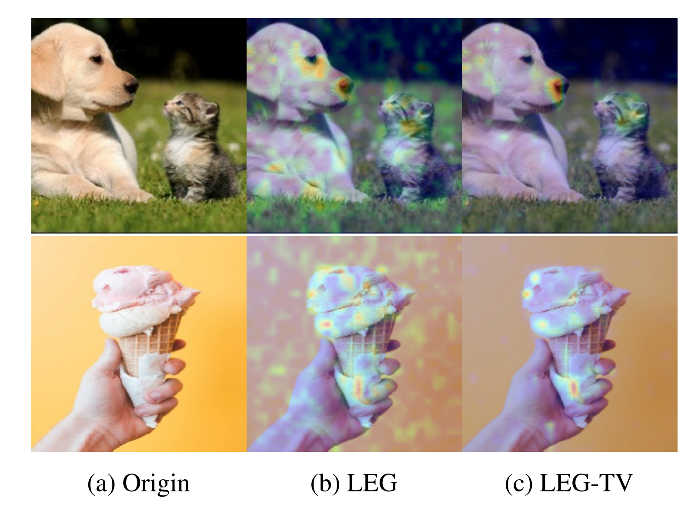

# LEG(Linearly Estimated Gradient)
{: .fs-9 }

LEG gives you a visual interpretation of what is happening under the hood of deep learning models.
{: .fs-6 .fw-300 }

[Get started now](#getting-started){: .btn .btn-primary .fs-5 .mb-4 .mb-md-0 .mr-2 } [View it on GitHub](https://github.com/Paradise1008/LEG){: .btn .fs-5 .mb-4 .mb-md-0 }

---

## Getting started

### Dependencies

* [cvxpy](https://github.com/cvxgrp/cvxpy) 
* [Mosek](https://www.mosek.com/documentation/)
* [tensorflow/keras](https://www.tensorflow.org/)
* [matplotlib](https://matplotlib.org/users/installing.html)
* [skimage](https://github.com/scikit-image/scikit-image)

### [Quick start]({{ site.baseurl }}/docs/quick%20start)

### What is LEG explainer?

LEG is a statistical framework for saliency estimation for black-box computer vision
models. You can find the paper [here](https://openaccess.thecvf.com/content/ICCV2021/papers/Luo_Statistically_Consistent_Saliency_Estimation_ICCV_2021_paper.pdf)

There is also a new computationally efficient estimator (LEG-TV) proposed using graphical
representations of data.

## A Visual Example

---

## About the project

LEG explainer 2019-{{ "now" | date: "%Y" }} by [Paradise1008](https://github.com/Paradise1008).

## License

None

